# Установка сервера Ubuntu в WirtualBox

### Шаг 1. Скачивание Ubuntu 20.04.

Задания мы будем выполнять на самой ~~глючной~~ распространённой версии серверной ОС - Ubuntu Linux. На момент написания данного гайда требовалось установить Ubuntu 20.04, возможно что после выхода следующей пятилетней LTS ситуация измениться, мониторьте свои задания после 2025 года.

Заходим на [официальный сайт](https://releases.ubuntu.com/focal/ "скачать Ubuntu 20.04") и выбираем "server install image":

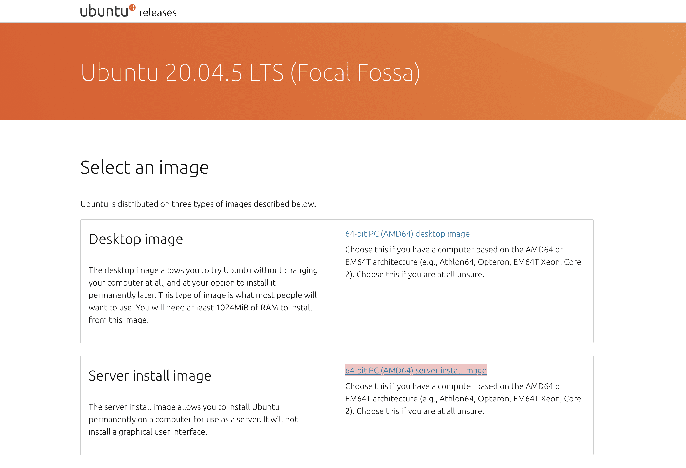

Небольшой лайфхак: учётка школьных маков не резиновая, а образы ОС весят много. Можно изменить место сохранения файлов в браузере на папку goinfre чтобы сохранять файлы непосредственно в памяти рабочего mac-а. Настройки на примере Google Chrome:


Там же на goinfre мы будем разворачивать и образы виртуальных машин, в учётке им просто не будет места. Но обо всём по порядку.

Когда образ скачался, мы открываем wirtualbox и нажимаем "Создать" на вкладке "Инструменты"

В качестве имени образа можно ввести ubuntu_01, а папку обязательно выбрать на goinfre, я назвал её так же ubuntu_01:

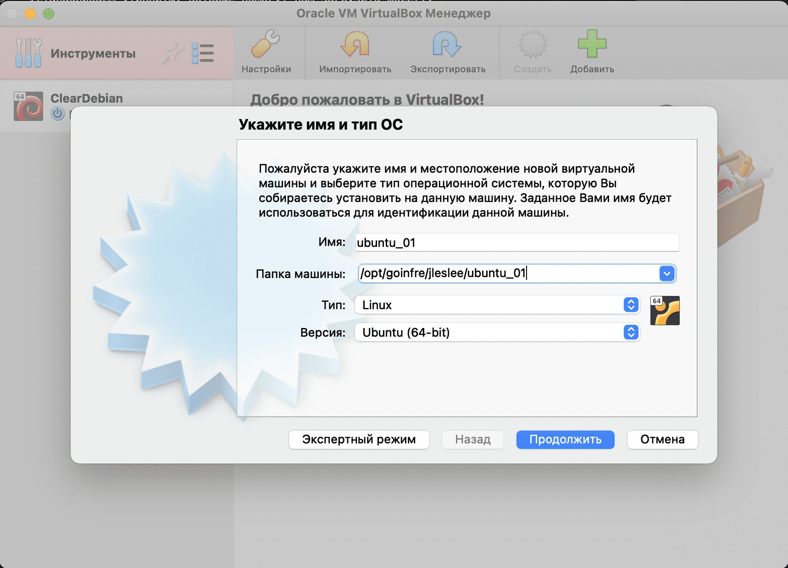

Далее я выбрал 2048 МБ оперативной памяти, далее выбрал создать новый виртуальный жёсткий диск с типом VDI.

На следующем шаге подтвердил, что диск будет динамическим, далее убедился, что он записывается в goinfre и нажал "Создать".

Не открывая (!) созданной конфигурации я зашёл в настройки и выбрал вкладку "Дисплей". Здесь я увеличил разрешение экрана до 200%, потому как 100% на экране мака с большим разрешением - слишком мало. Если вдруг не будет хватать и двухсот, разрешение можно повысить ещё.


Далее я повысил число выделенных ядер до двух, потому как одного ядра для операционки обычно ну совсем мало (вкладка "система" -> "процессор"):

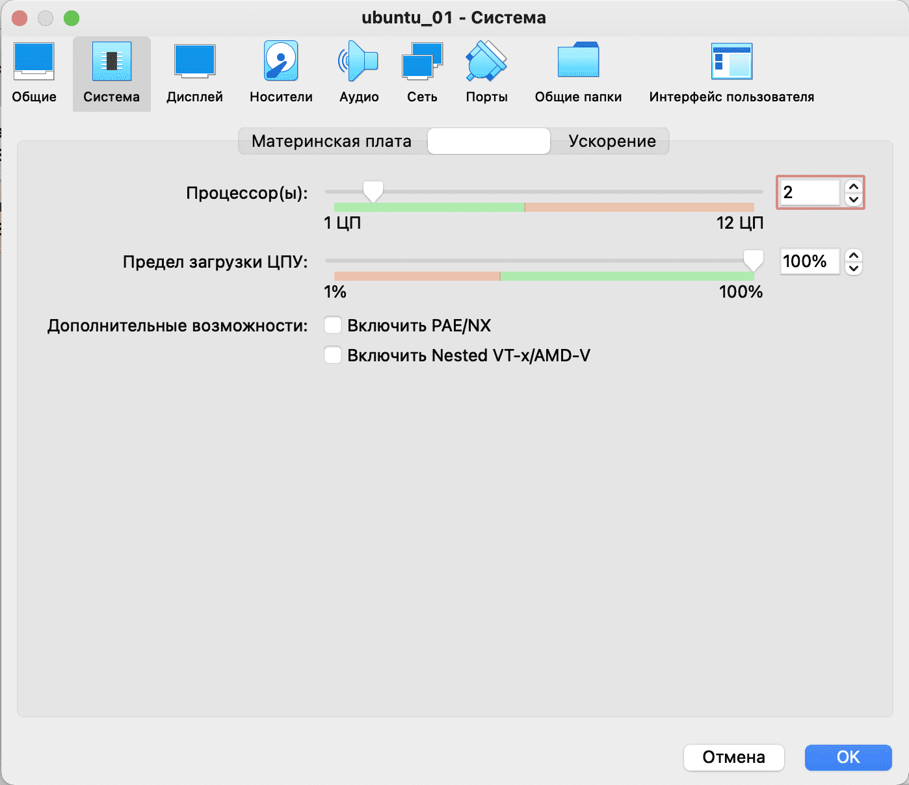

И толкьо после этих действий я запускаю установку ОС, щёлкнув на зелёную стрелочку.

### Шаг 2. Установка Ubuntu 20.04.

Как только запустилась установка нам предложат выбрать язык. Для наглядности я выбираю Русский, кто хорошо знаком с другими языками, может выбрать язык по вкусу.

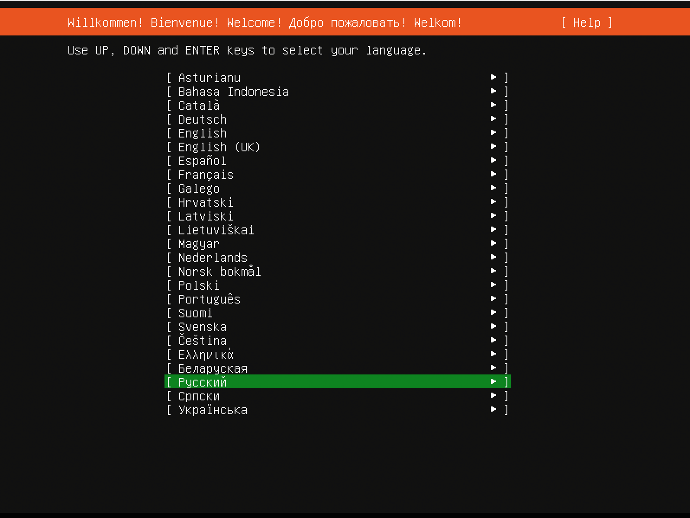

В процессе установки моя убунта захотела обновиться, и я разрешил ей сделать это:

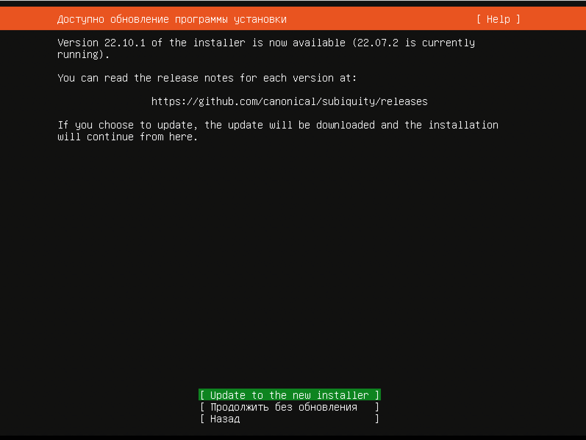

Далее я просто нажимаю "продолжить (оно же "done") до момента когда нужно подтвердить форматирование диска:

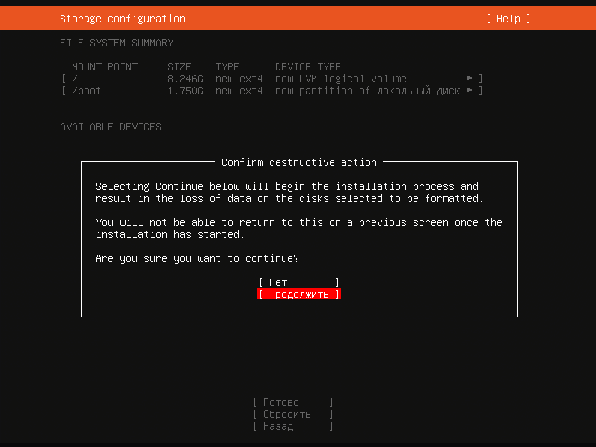

После нас встретит окно выбора пользователя и пароля:

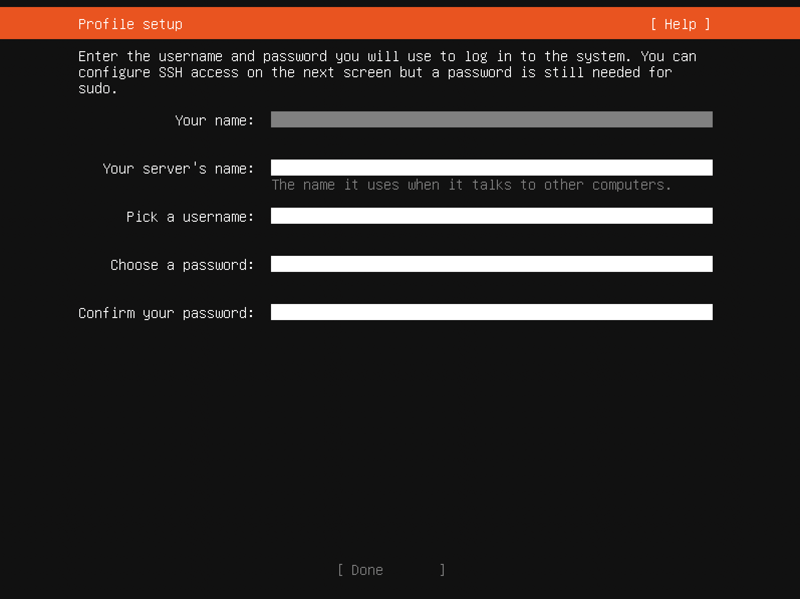

Вводим здесь имя пользователя и самый простой пароль (я выбрал единицу), перемещаясь по строкам табом. В качетсве имени хоста сервера я выбрал ubuntu_01. В качестве имени пользователя просто указал ``user``, однако можно использовать, например, свой ник на платформе.


После запустится установка системы. Дождёмся пока она пройдёт до конца и обязательно установим SSH-сервер(!)

На установке дополнительного софта мы акцентироваться не будем, всё что нужно доустановим сами. Пропускаем этот шаг:

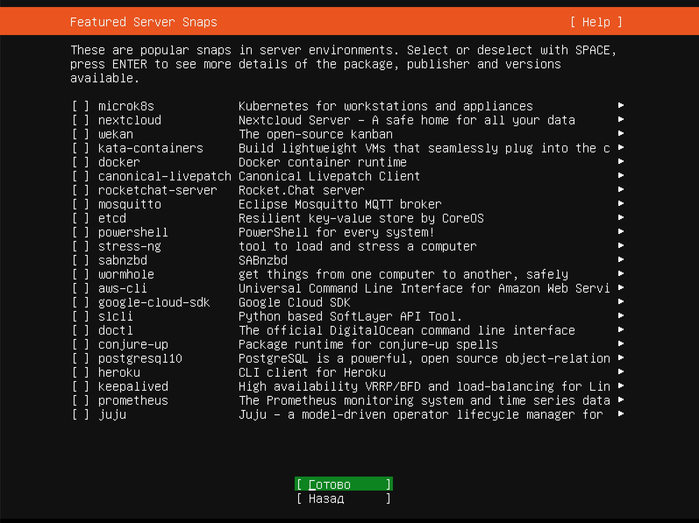

Далее ждём, пока наша система установится. Ждать придётся несколько минут.

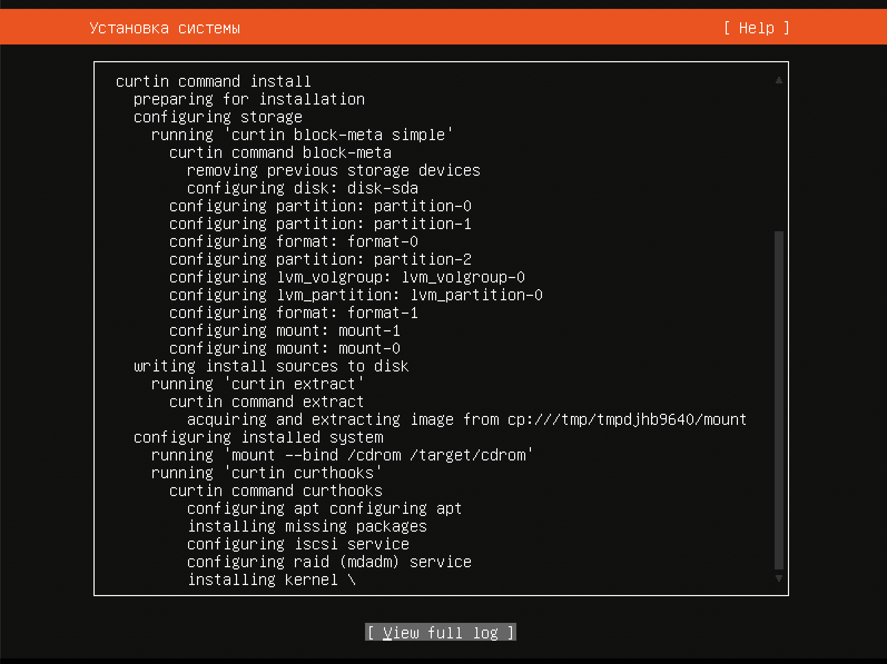

После установки внизу появится строка "Перезагрузить сейчас". Нажимаем на неё и перезагружаемся.

После первого запуска вводим наш логин и пароль и попадаем в терминал TTY. Нам нужно будет произвести ещё кое-какие настройки, поэтому выключим машину, набрав в терминале

``sudo shutdown now``

### Шаг 3. Настройка виртуальной машины и проброс портов.

Обязательно отмонтируем CD-Rom потому как глючная бубунта будет на него жаловаться (по крайней мере 20.04.5 у меня активно жаловалась на него при старте). Для этого зайдём в настройки -> система и уберём галочку с пунктов "гибкий диск" (он не нужен в принципе уже целому поколению айтишников) и "оптический диск" (тот самый образ системы, который не может примонтировать установленная система при старте):

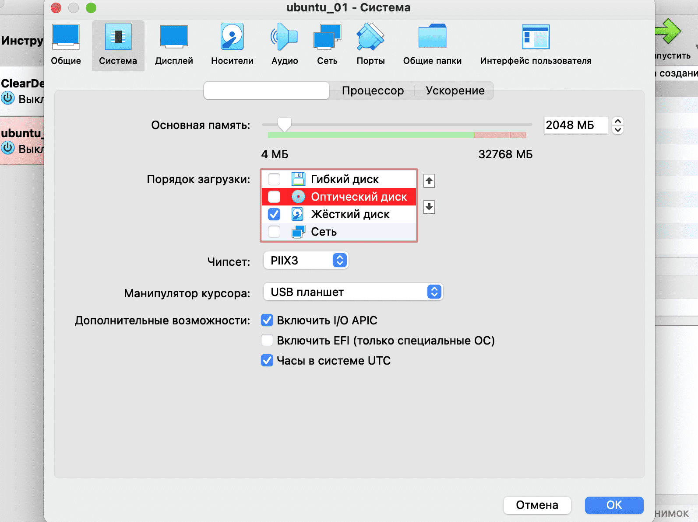

Далее прокинем порты вовне чтобы мы могли подключаться к системе по SSH непосредственно из терминала хостовой машины. Какой порт открывать - написано в части, касающейся настройки SSHD (Part 8 если ничего не поменялось) задания, на данный момент это порт 2022.

Заходим во вкладку "сеть". Разворачиваем вкладку "дополнительно" в самом низу. И внизу находим кнопку "проброс портов". Делаем проброс как показано ниже:

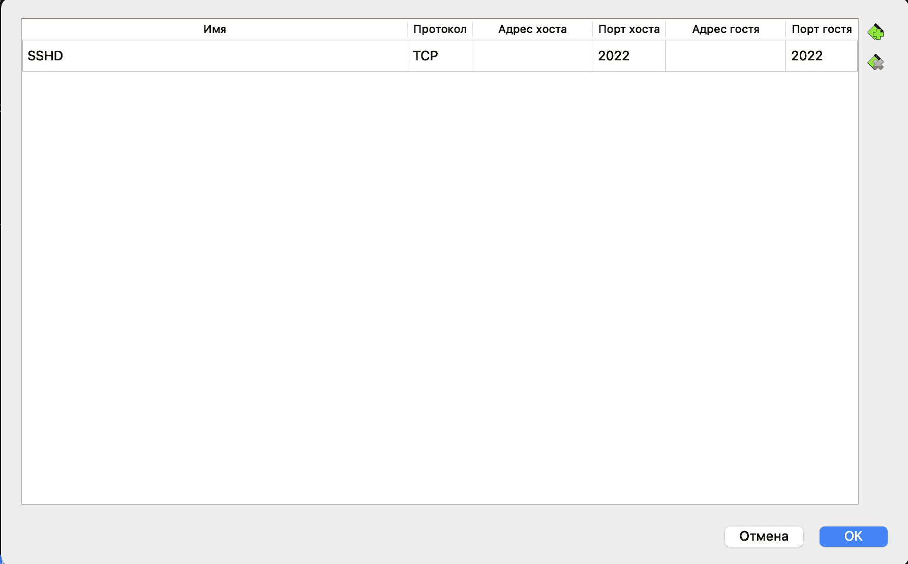

Применяем, закрывем, снова запускаем систему. 

### Шаг 4. Настройка SSHD.

Теперь необходимо настроить наш ssh-сервер для удалённого подключения к машине. Заходим по нашим пользователем в окне virtualbox и вводим команду:

``sudo nano /etc/ssh/sshd_config``

> Предполагается, что пользоваться редактором nano ты уже умеешь. Если нет - читай Part 7 на странице "[установка софта](https://github.com/codesshaman/sber_devops_d01_linux-master/blob/main/03_INSTALL_SOFT.md "Установка софта")".

Удаляем комментарий рядом с надписью ``#Port 22`` и меняем цифру 22 на 2022. Так же разрешаем логиниться под ``root`` (только для обучения, не повторять на продакшен-серверах!):

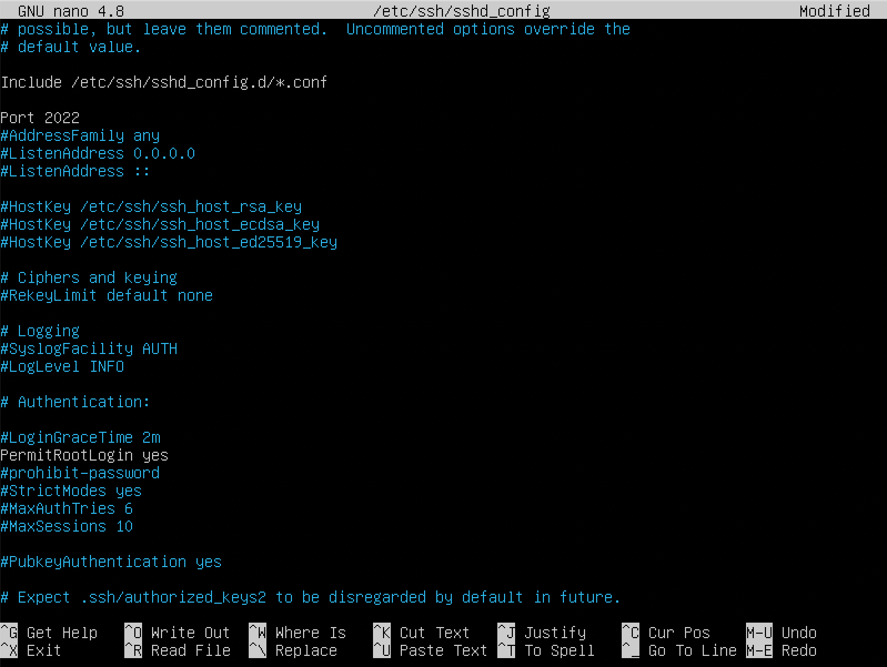

Далее разрешаем как логин по ключу, так и логин по паролю:

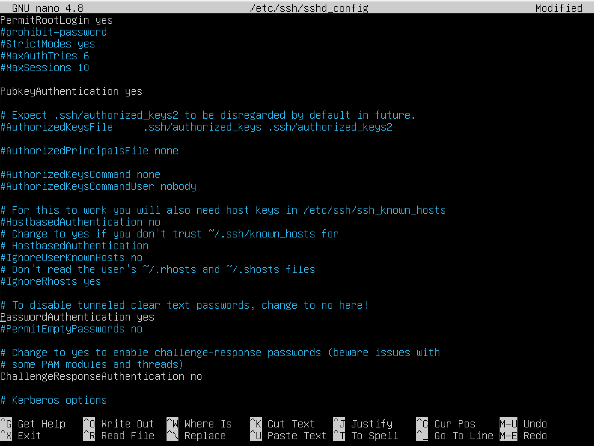

Сохраняем, закрываем, перезапускаем демона (да, сервисы в Линукс называются демонами, и мы будем повелевать ими!) sshd:

``sudo service sshd restart``

После на всякий случай проверим, а перезапустился ли он, командой ``sudo service sshd status``. Его нормальное состояние выглядит вот так:

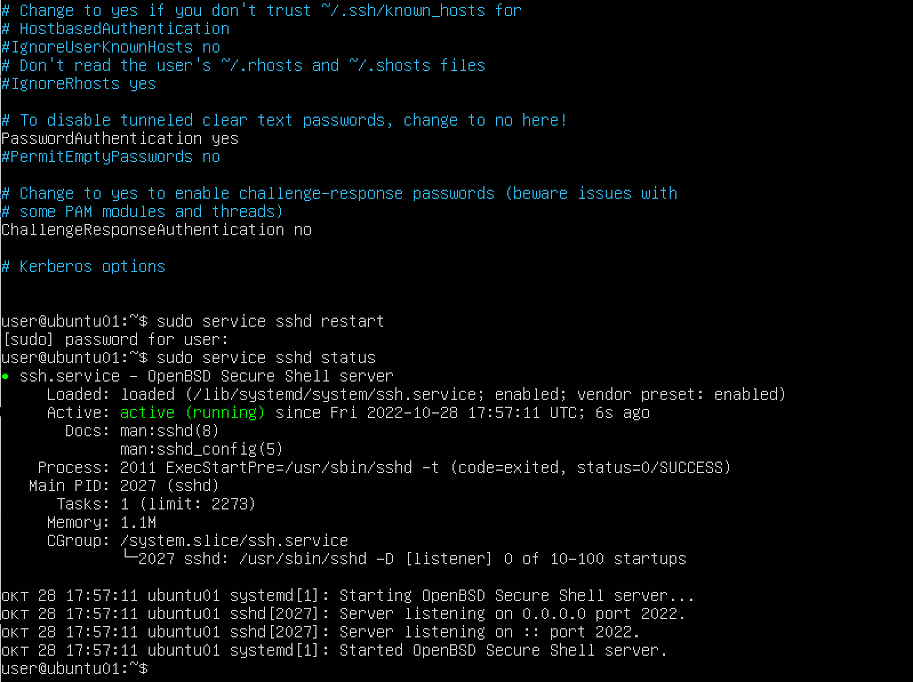

### Шаг 5. Настройка файервола.

По умолчанию в нашей ubuntu встроен файервол iptables, это очень функциональный и довольно сложный в изучении файервол. Но к счастью у iptables есть надстройка под названием ufw, которая позволяет оперировать правилами что называется в одну команду.

Сначала проверим ``sudo ufw status``. Система должна вывести "Status: inactive". Если система жалуется, что "sudo: ufw: command not found", то делаем ``sudo apt install -y ufw``.

Если же ufw есть и неактивен, активируем его командой ``sudo ufw enable``. После этого нам должны сообщить, что "Firewall is active and enable on system startup". И это замечательно.

Теперь берём и открываем вовне наш порт 2022:

``sudo ufw allow 2022``

Ответ должен быть таким:

```
Rule added
Rule added (V6)
```

Так же можно проверить, что порт открыт, при помощи команды ``sudo ufw status``.

Так мы открыли наш порт 2022 для внешних подключений, и теперь мы можем подключиться через терминал к нашему виртуальному серверу.

### Шаг 6. Удалённое подключение.

Наш сервер находится на хостовой машине, стало быть адрес у него - 127.0.0.1, он же loopback. Общепринятым именем этого хоста является "localhost". Подключиться к нему мы можем, используя этот ip или это имя.

Итак, скопируем в наш терминал следующую команду:

``ssh user@localhost -p 2022``

В качестве ``user`` мы вводим имя нашего пользователя (так как у меня пользователь и называется "user", я буду использовать его).

Во время первого подключения нам предложат сохранить сессию, и мы соглашаемся, введя в терминале ``yes``. После мы войдём на наш виртуальный хост, где с нас спросят пароль нашего пользователя:

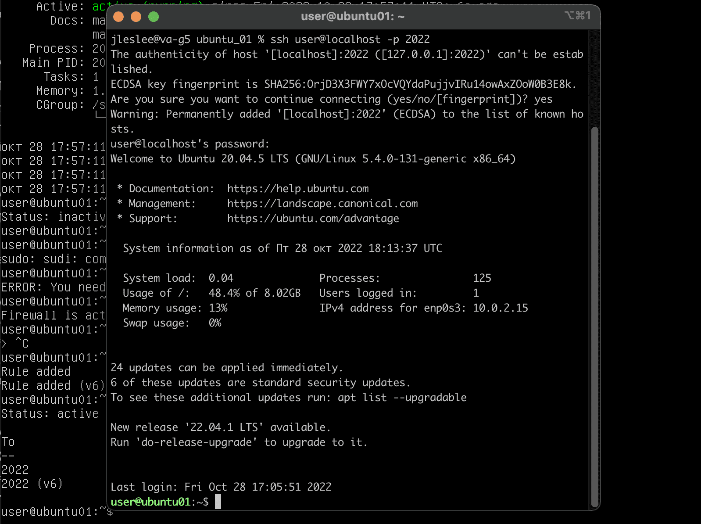

Поздравляю, мы зашли на наш виртуальный сервер, и отныне мы можем копипастить туда команды из этого гайда! Ура!

Далее мы настроим вход по ключу без пароля.

### Шаг 7. Генерация ключей.

Для всей дальнейшей работы мы теперь используем терминал хостовой системы, окно virtualbox можно даже свернуть в трей. Так же нам понадобится второй открытый терминал хоста для генерации ssh-ключей.

На маке второй терминал можно открыть через ``command+T``. Не закрывая первый терминал, откроем ещё один:

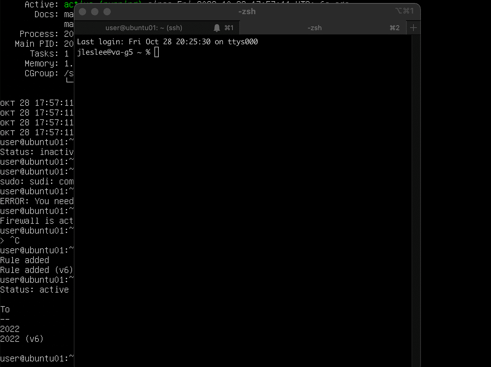

Теперь между сессией хоста и виртуальным сервером можно переключаться по ``control+Tab``, как между вкладками барузера или IDE.

Зайдём в папку с ключами и создадим там новый каталог для нашего сервера:

``cd .ssh``

``mkdir ubuntu_01``

Переходим в созданный каталог и получаем полный путь до него:

``cd ubuntu_01 && pwd``

Обязательно скопируем в буфер тот адрес, который выдала нам pwd, он нам ещё пригодиться.

Теперь мы сгенерируем пару ключей утиллитой ssh-keygen, просто введя эту команду:

``ssh-keygen``

Обязательно меняем дефолтный путь на полный путь до нашей папки просто вставив скопированную строку из буфера в первом же шаге ("Enter file in which to save the key"), добавив к нему имя файла (можно использовать любое, я выбрал id_rsa):

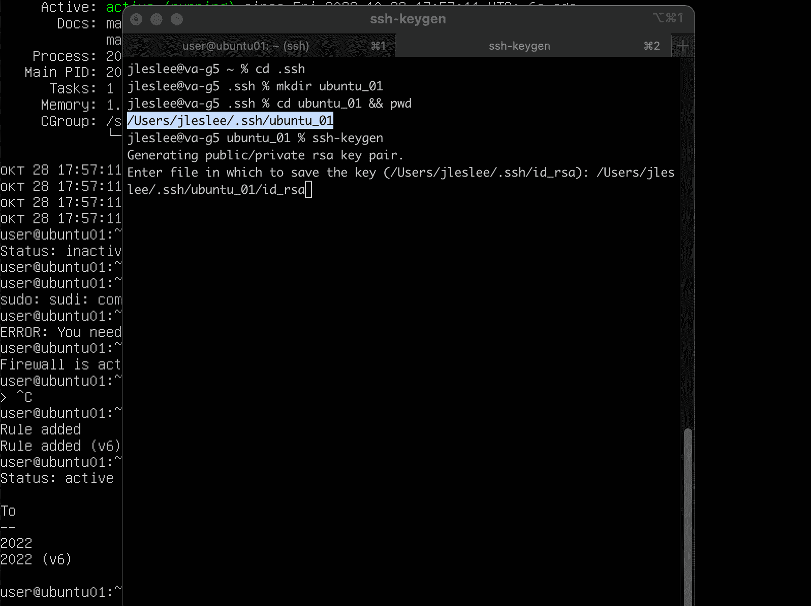

Нажимаем "Enter" и получаем предложение ввести пароль для шифрования связки ключей. Не будем шифровать наши ключи паролем, на предложение ввести пароль просто нажимаем "Enter" дважды.

И нас снова ждёт успех: ключи успешно сгенерированы и мы можем проверить их наличие командой ``ls -la``:

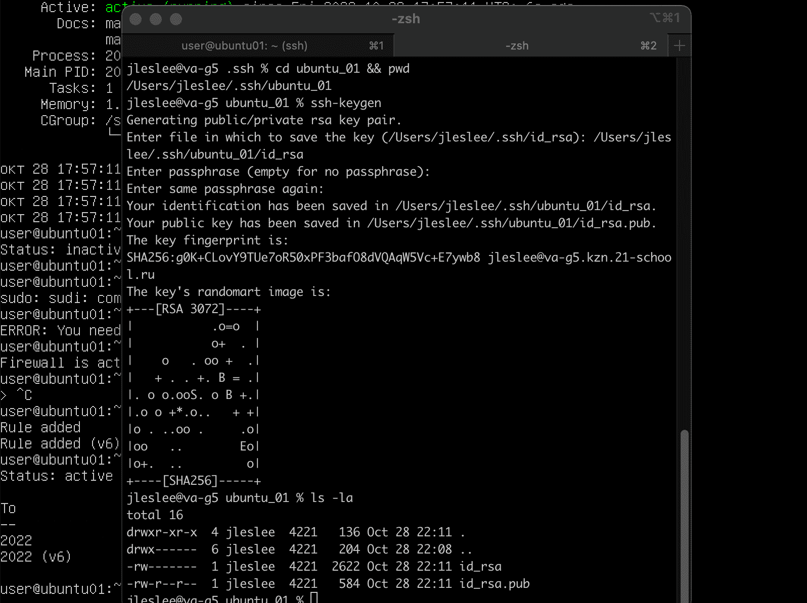

Теперь наша задача - передать сгенерированный ключ наему хосту. Для этого вводим следующую команду:

``ssh-copy-id -i id_rsa.pub user@localhost -p 2022``

Нам предложат ввести пароль пользователя и наш ключ будет добавлен на сервер:

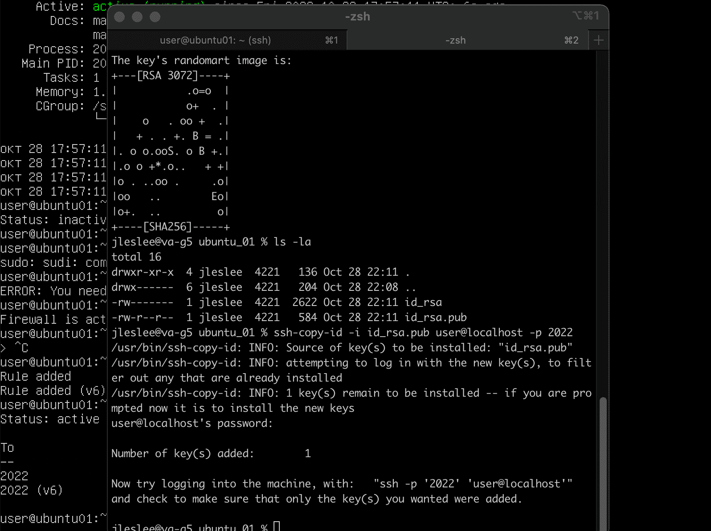

Убедимся, что ключ попал туда. Для этого сначала введём команду ``cat <имя_ключа.pub>``, что в моём случае ``cat id_rsa.pub``, а затем перейдём на вкладку, в которой мы залогинились на нашем локальном сервере по ``control+Tab`` и введём команду:

``cat ~/.ssh/authorized_keys``

Попереключаемся по ``control+Tab`` и убедимся, что данные совпадают:

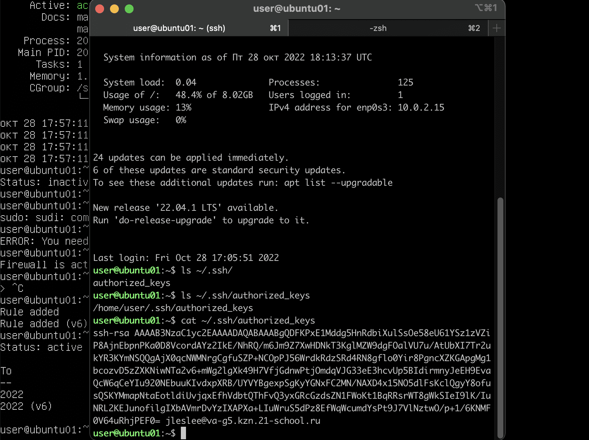

### Шаг 8. Создание конфига ssh.

Создаём на нашем хосте в папке .ssh файл с именем config:

``nano ~/.ssh/config``

Вставляем туда следующий код:

```
Host localhost
  IdentityFile ~/.ssh/ubuntu_01/id_rsa
```

Сохраняем, закрываем.

### Шаг 9. Удалённое подключение без пароля.

Переключаемся по ``control+Tab`` на сервер и ещё раз отредактируем конфиг sshd:

``sudo nano /etc/ssh/sshd_config``

Раскомментируем строку AuthorizedKeysFile, а PasswordAuthentication наоборот закомментируем:

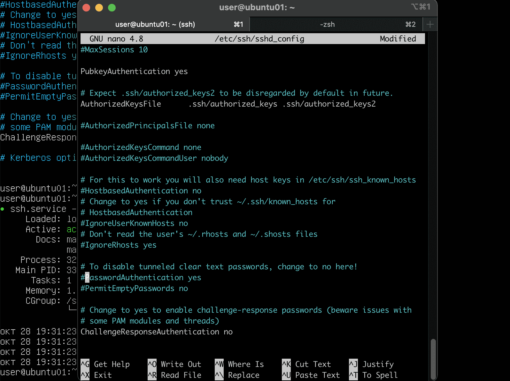

Перезапустим демона:

``sudo service sshd restart``

Проверим, что мы можем логиниться на сервер бед пароля. Для этого отключимся от сессии, введя ``exit`` или нажав ``control+D``. 

Мы должны войти на сервер, не получив запроса пароля. Если этого не произошло, ещё раз проверяем пути к файлу с ключом в нашем конфиге и authorized_keys на сервере.

Если всё прошло успешно, поздравляю: мы выполнили не только первую часть задания (установка ОС), но ещё и восьмую (настройка SSHD).

Теперь мы можем выключать виртуальную машину командой ``sudo shutdown now`` (sudo shutdown выключит нас через минуту, потому не забываем скомандовать выключить сейчас - now) и закреплять достигнутый результат, сохранив снимок состояния системы, сделав экспорт и загрузив результаты нашего труда, например, в облако. Об этом [следующий гайд](https://github.com/codesshaman/sber_devops_d01_linux-master/blob/main/01_EXPORT_AND_SAVE.md "Сохранение и экспорт").
