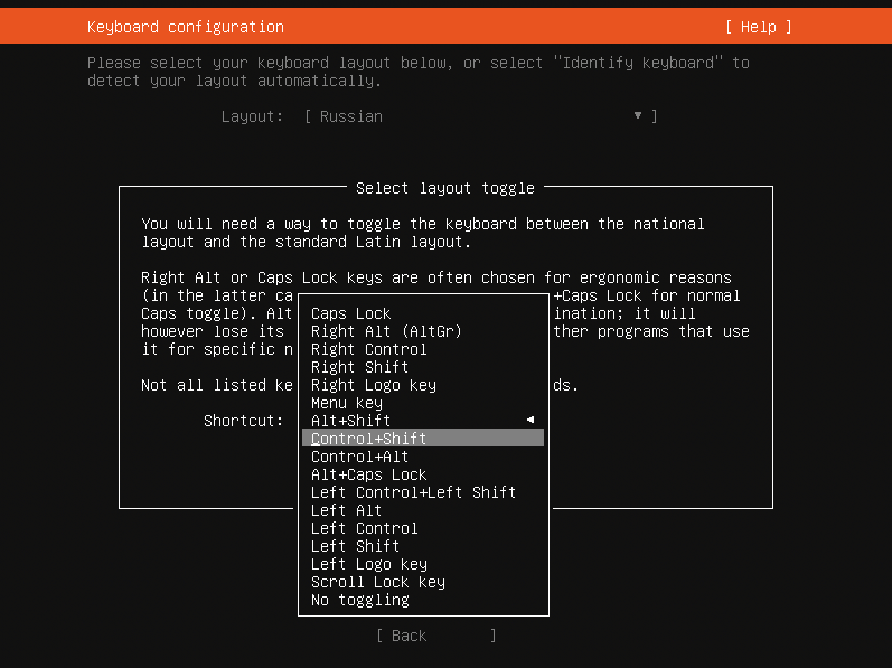

# Установка сервера Ubuntu в WirtualBox

### Шаг 1. Скачивание Ubuntu 20.04.

На момент написания данного гайда требовалось установить 

Заходим на [официальный сайт](https://releases.ubuntu.com/focal/ "скачать Ubuntu 20.04") и выбираем "server install image":

Небольшой лайфхак: учётка школьных маков не резиновая, а образы ОС весят много. Можно изменить место сохранения файлов в браузере на папку goinfre чтобы сохранять файлы непосредственно в памяти рабочего mac-а. Настройки на примере Google Chrome:

Там же на goinfre мы будем разворачивать и образы виртуальных машин, в учётке им просто не будет места. Но обо всём по порядку.

Когда образ скачался, мы открываем wirtualbox и нажимаем "Создать" на вкладке "Инструменты"

В качестве имени образа можно ввести ubuntu_01, а папку обязательно выбрать на goinfre, я назвал её так же ubuntu_01:

Далее я выбрал 756 МБ оперативной памяти (в одном из заданий мы развернём сразу пять подобных машин, поэтому можно сразу начинать экономить оперативку), далее выбрал создать новый виртуальный жёсткий диск с типом VDI.

На следующем шаге подтвердил, что диск будет динамическим, далее убедился, что он записывается в goinfre и нажал "Создать".

Не открывая (!) созданной конфигурации я зашёл в настройки и выбрал вкладку "Дисплей". Здесь я увеличил разрешение экрана до 200%, потому как 100% на экране мака с большим разрешением - слишком мало. Если вдруг не будет хватать и двухсот, разрешение можно повысить ещё.

Далее я повысил число выделенных ядер до двух, потому как одного ядра для операционки обычно ну совсем мало (вкладка "система" -> "процессор"):

И толкьо после этих действий я запускаю установку ОС, щёлкнув на зелёную стрелочку.

### Шаг 2. Установка Ubuntu 20.04.

Как только запустилась установка нам предложат выбрать язык. Для наглядности я выбираю Русский, кто хорошо знаком с другими языками, может выбрать язык по вкусу.

В процессе установки моя убунта захотела обновиться, и я разрешил ей сделать это:

В качестве переключателя раскладки я выбрал Alt+Shift, но это дело вкуса каждого:

Далее я просто нажимаю "продолжить (оно же "done") до момента когда нужно подтвердить форматирование диска:

После нас встрети окно выбора пользователя и пароля:

Вводим здесь наш ник и самый простой пароль (я выбрал единицу), перемещаясь по строкам табом. В качетсве имени хоста сервера я выбрал ubuntu_01. 

На этом этапе у меня уже ни раз зависала система и я прошёл его только с четвёртого раза. Привыкаем к глючности убунты, за танцы с бубном вокруг которой в народе её давно уже прозвали "бубунта". Если захотите тестировать свои навыки на стабильной операционной системе - выбирайте Debian, который легко крутится и не виснет даже на 512 МБ оперативы. Однако создатели школьных заданий не ищут лёгких путей, да и убунту - система весьма распространённая, так что будем работать на ней, к чему бы ни готовила нас жизнь.

После того, как мы с горем пополам ввели данные, запустится установка системы. Дождёмся пока она пройдёт до конца и обязательно установим SSH-сервер:

На установке дополнительного софта мы акцентироваться не будем, всё что нужно доустановим сами. Пропускаем этот шаг:

Далее ждём, пока наша система установится. Ждать придётся несколько минут.

