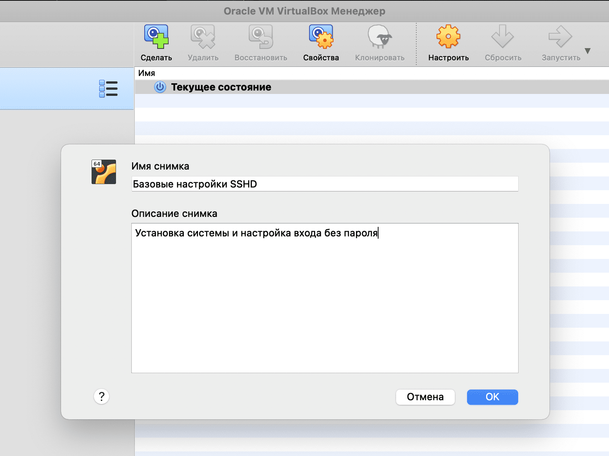
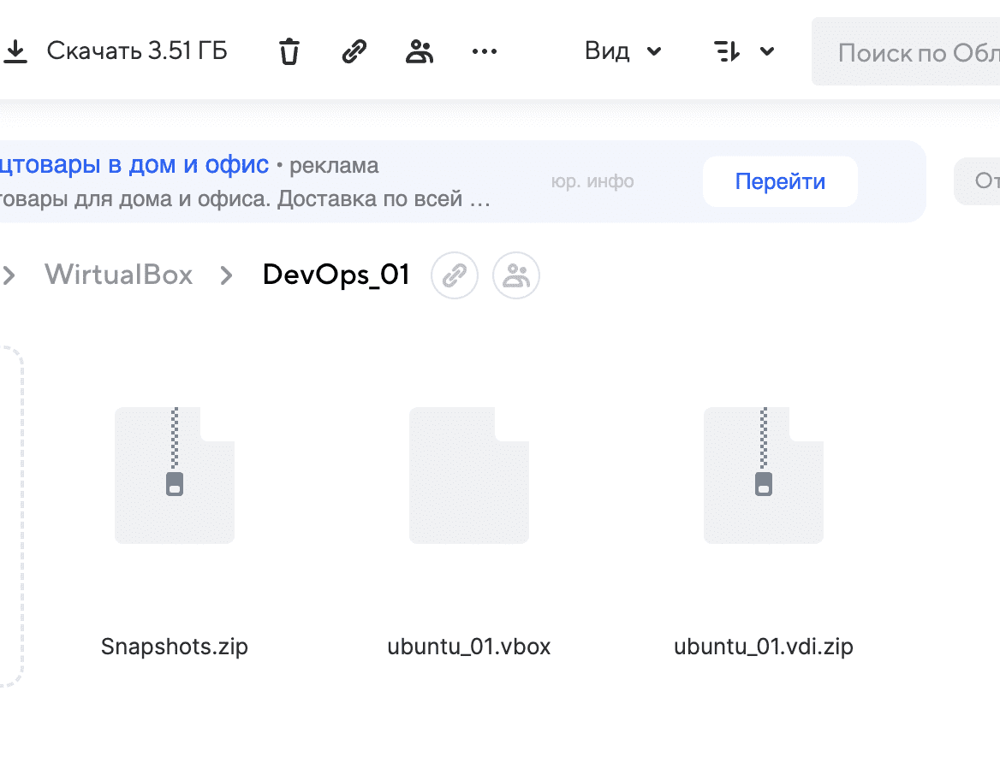

# Сохранение конфигурации virtualbox

Одно из главных умений разработчика и devops-а - умение сохранять критически важную информацию. Это касается как паролей (рекомендую keepass), так и ssh-ключей (можно хранить в текстовых полях того же keepass-а).

Но пароли нужны для доступа к инфраструктуре, а для сохранения её информации требуется скорее резервное копирование всей инфраструктуры или её критически важных частей.

Так как наша инфраструктура развёрнута в виртуальной машине, то и сохранять мы будем виртуальную машину. В виртуалках можно сделать "бэкап" всей системы - так называемый "снимок состояния" или snapshot. А специально для тех, кто хочет работать и в школе, и дома, и на разных машинах, я расскажу как сохранять виртуальную машину в облако и разворачивать её оттуда.

### Шаг 1. Создание снапшота

Сначала сделаем снимок состояния системы. Он делается строго при выключенной машине. Нажимаем на кнопку меню рядом с названием нашей машины и выбираем "снимки":

Теперь нажимаем на верхнюю кнопку с зелёным плюсом - "сделать снимок". Вводим название и понятное нам описание:

По нажатию ОК через короткое время снимок будет сделан и появится в окне снапшотов, наше текущее состояние системы будет перенесено ниже этого снимка:

Если снимков много, мы можем переходить к любому из них, делать ветвления снапшотов, при этом текущее состояние может быть в любой из получившихся веток.

Но сейчас нам это не нужно - достаточно просто делать снапшоты после каждого важного полноценного изменения в системе, тогда не придётся начинать сборку проекта с нуля, если мы вдруг сломаем систему (что не исключено в opensource-дистрибутивах). Так же снимки помогут нам, если просто нужно будет повторить с нуля какой-то неполучившийся шаг.

### Шаг 2. Сохранение в облако

Пять виртуальных машин во втором задании займут уйму места и нашу учётку точно никто не готовил к такой жизни. Места на ней не хватит однозначно.

Именно поэтому мы сохраняем виртуальные машины в память компьютера - в папку goinfre. Однако для того, чтобы иметь к ним физический доступ, мы должны работать за тем же компьютером.

В школе много людей, и далеко не факт, что компьютер, на котором ты работал вчера, не будет занят кем-то сегодня. Кто-то решает эту проблему бумажками с предупреждением - "сядешь за мой компьютер - убью!", а кто-то сохраняет свои конфигурации на любые доступные носители (телефон/флешка/облако) и не парится на счёт места.

На этом шаге я покажу, как работать с любого доступного мака и не привязываться к определённому месту.

Я сохраняю свои конфигурации в облако. Если нет облака, можно зарегистрировать аккаунт в любом доступном. Например, новозеландская ["Мега"](https://mega.io/ "сайт мега") даёт бесплатно 20 гигабайт облачного пространства (когда-то давали 50, но, видимо, датацентры Новой Зеландии не резиновые), наш мэйл ру даёт восемь гигов, яндекс диск - 16 плюс куча бонусов и акций. Да и вообще, многие давно уже раздобыли себе по большому объёму пространства по различным акциям.

В общем, если нет облака нужного размера - регистрируемся в одном из облачных сервисов или приносим флешку, если есть - сохраненяем в облако.

У меня есть акционный террабайт на мейле не считая других аккаунтов меги, яндекса и гугла. Основные данные я храню на нём. Но на мэйле, как и на большинстве других сервисов, стоит ограничение по обьёму файлов - с бесплатным тарифам нельзя закачивать и скачивать более 2-х гигабайт одним файлом. А наша система весит больше четырёх гигов.

Не беда! Сожмём её стандартными средствами и уменьшим до нужного объёма:

В сжатом виде моя система уменьшилась до 1,7 ГБ. Теперь её можно заливать в облако!

Сохраним всё нужное из нашей папки в облако.

Теперь сам проект, его экспортирвоанный в .ova вариант и  снапшоты весят меньше, чем развёрнутая система.

### Шаг 3. Развёртывание на другом компьютере

Если мы пересядем за другой мак и запустим наш virtualbox, то увидим, что файлы системы недоступны:

Это не значит, что систему можно удалять, это лишь означает, что в памяти нашего мака нет данной системы. Восстановим же её.

Скачиваем из облака папку со снапшотами (скачается архивом), файл ubuntu_01.vdi.zip и файл ubuntu_01.vbox. Содаём в goinfree папку с таким же названием, как и на предыдущем месте. Переносим туда эти файлы, все архивы распаковываем.

В итоге перезапустив virtualbox мы обнаружим, что наша система готова к работе:

Таким образом мы больше не привязаны к месту, за которым кодим, и это хорошо. Теперь мы точно готовы к тому, чтобы приступать к глубокому изучению линукса.

И не забываем делать снимки системы, они сберегут нам много нервов!

Переходим к [настройке системы](https://github.com/codesshaman/sber_devops_d01_linux-master/blob/main/02_SYSTEM_SETTING.md "Настройка системы").