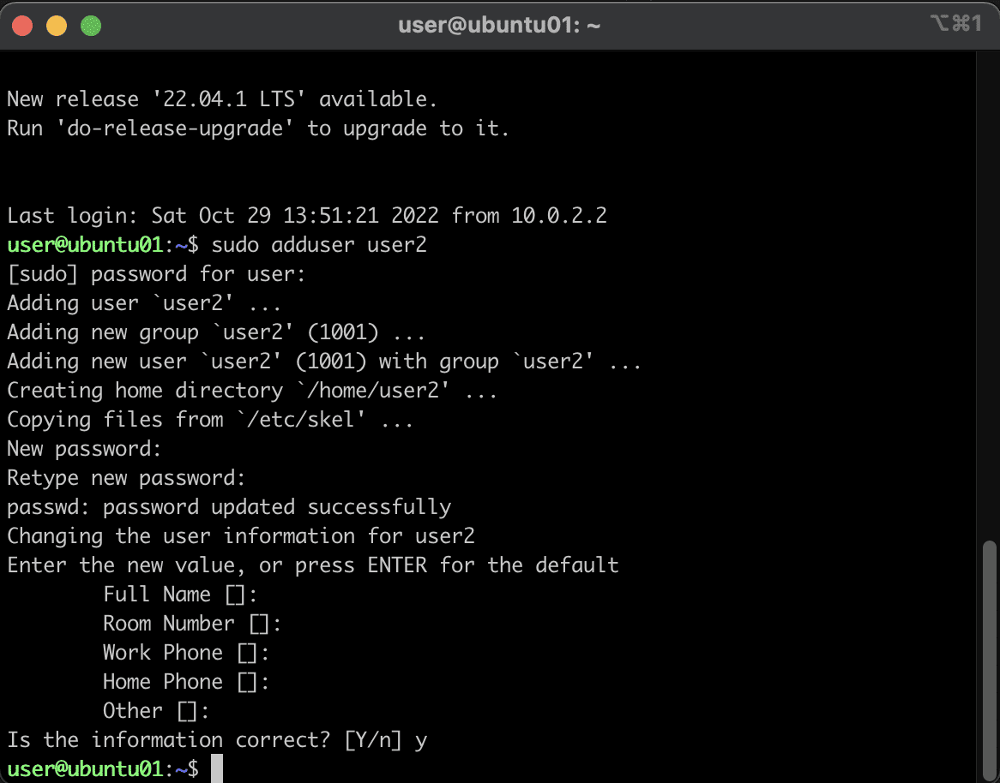
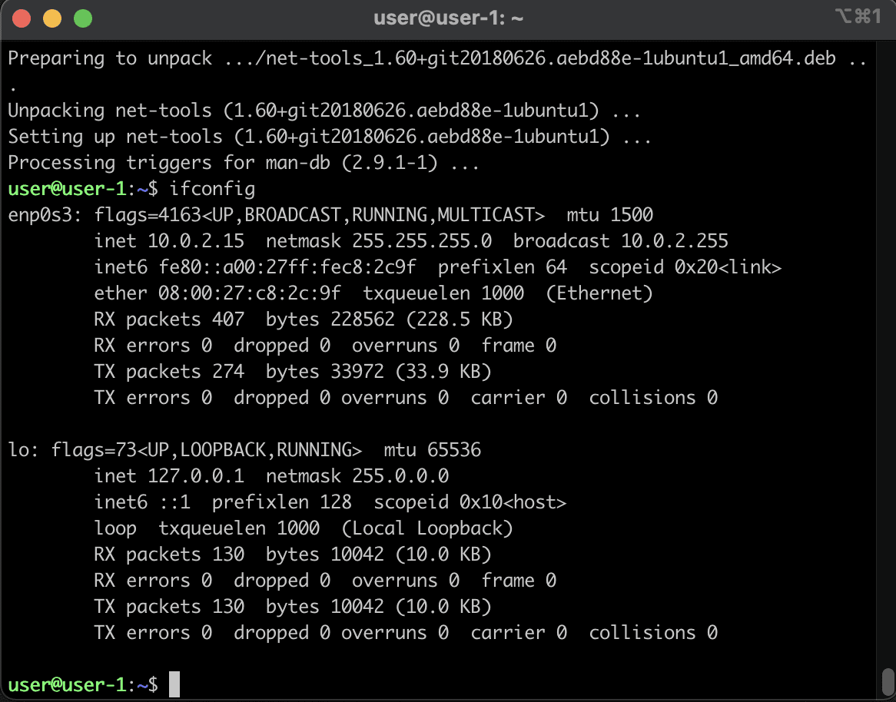
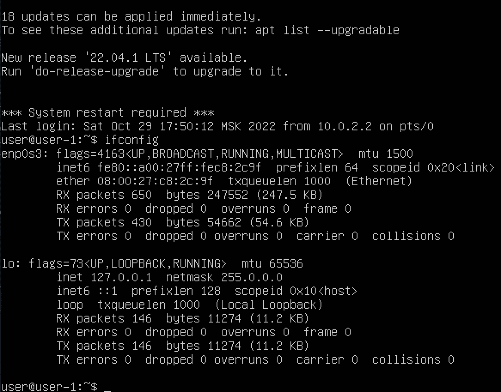
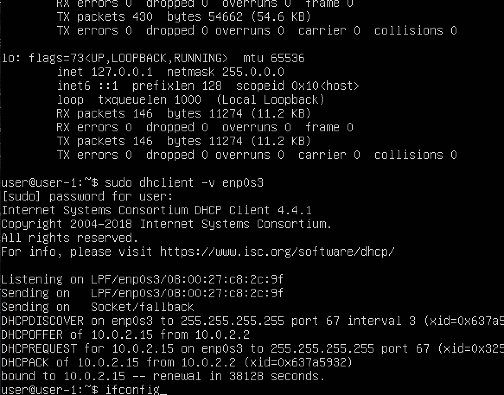
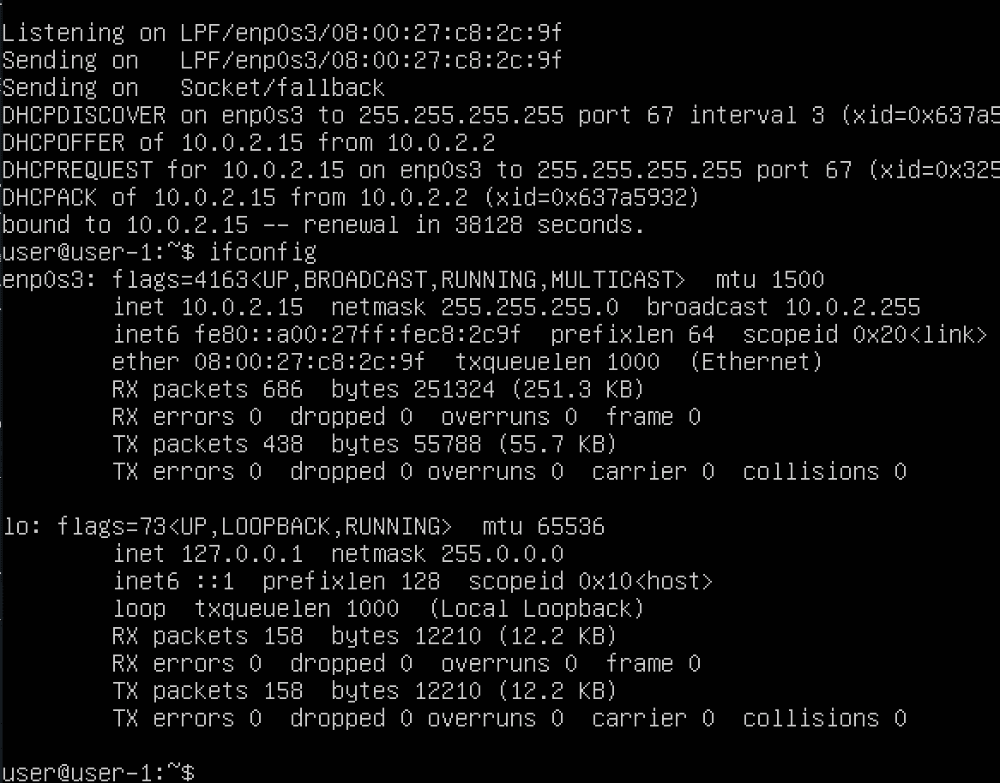
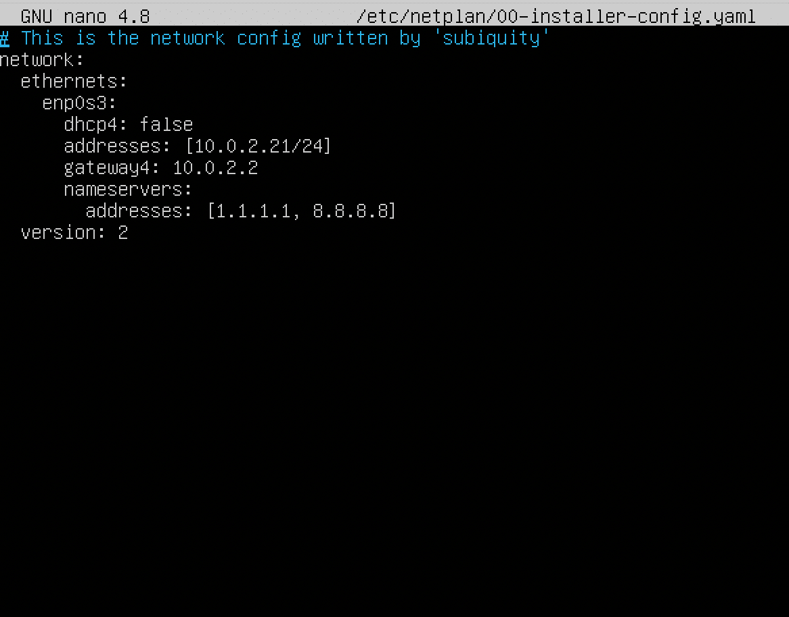
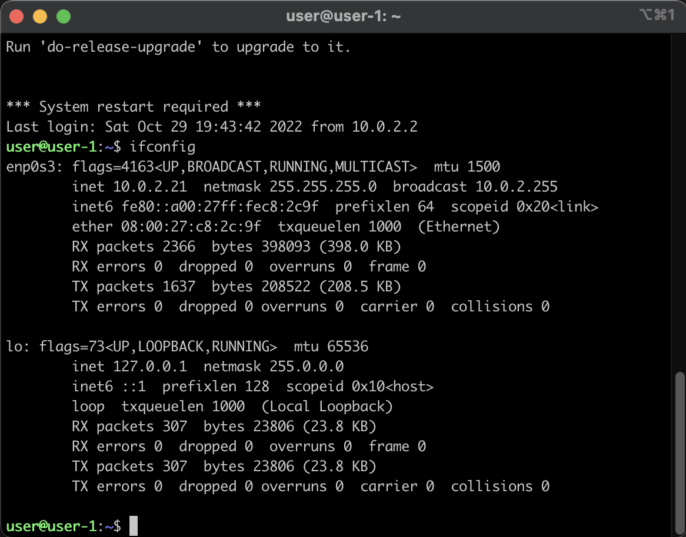
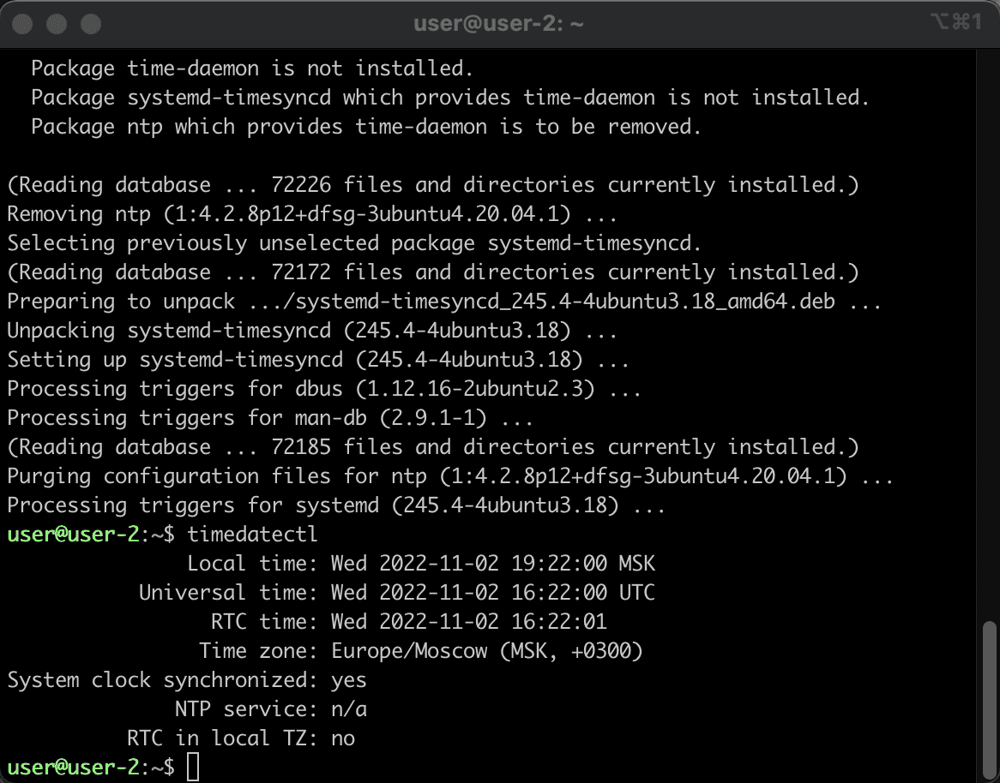

# Настройки системы

Теперь приступаем непосредственно к заданию. По сути мы уже выполнили Part 1 - установили систему, и Part 8 - сделали доступ по ssh. Далее перечислим нужные нам моменты, которые есть в тех или иных частях задания. В заголовке будет обозначена часть (например, Part 1.), внутри будут подзаголовки, в которых расписаны шаги, необходимые для выполнения этой части.

Начнём с простого. Для примера выполним задание из 

## Part 1. Установка ОС

### Шаг 1. Вывод версии

Здесь нам нужно просто нужно выполнить команду 

``cat /etc/issue``

и вставить скриншот с выводом команды.

Все остальные шаги выполнены в первом гайде.

Идём дальше.

## Part 2. Создание пользователя

Для создания пользователей в линукс существуют две разные команды - adduser и useradd. Поупражняться в них можно самостоятельно, я же покажу, как создать пользователя на примере adduser.

### Шаг 1. Создание пользователя

Просто выполняем команду ``sudo adduser user2`` и она создаст нам пользователя "user2", попутно спросив к нему пароль (поставил такой же - единицу) и кучу ненужной информации, которую можно пропустить просто нажимая "Enter":



По заданию нужно будет отправить свой скриншот с вызовом команды создания пользователя.

### Шаг 2. Чтение логов

Теперь дадим нашему пользователю права на чтение логов. Для этого добавим его в группу adm. Нет, не в слаке, в системе:

``sudo usermod -aG adm user2``

После этого перейдём на созданного пользователя:

``su user2``

Проверим, записался ли он в группу adm:

``groups``

Если в выводе мы увидим adm, значит мы можем читать логи.

Теперь выведем cat-ом главный системный лог:

``cat /var/log/syslog``

Мы получим много информации из системного журнала за текущий день. Таким образом, доступ к логам у нас есть.

### Шаг 3. cat /etc/passwd

Так же нам нужно выполнить ``cat /etc/passwd`` и отправить скрин с выводом этой команды. В самом конце файла должен наблюдаться наш созданный пользователь.

Теперь выходим из под нового пользователя, вернувшись к системному по ``control+D``.

## Part 3. Настройка сети ОС

### Шаг 1. Изменение имени хоста

Название машины хранится в /etc/hostname. Под старым пользователем изменим этот файл:

``nano /etc/hostname``

Заменим ubuntu_01 на user-1. Сохраняем файл и перезагружаемся по ``sudo reboot``. При следующем входе вместо "user@ubuntu01" нас встретит "user@user-1".

### Шаг 2. Изменение часового пояса

Текущий часовой пояс можно проверить командой ``timedatectl``, и вероятнее всего он равен UTC. Часовой пояс записывается в /etc/timezone, и при помощи ``cat /etc/timezone`` мы можем ещё раз убедиться, что ~~находимся на территории Англии~~ временная зона не настроена корректно.

Меняем часовой пояс командой:

``sudo timedatectl set-timezone Europe/Moscow``

где Europe/Moscow - наше месторасположение.

Теперь ``timedatectl`` покажет уже правильный часовой пояс, и ``cat /etc/timezone`` тоже.

### Шаг 3. Сетевые интерфейсы

Для работы с сетевым окружением в ubuntu используется утиллита net-tools. Установим её командой

``sudo apt install net-tools``

Теперь мы можем просмотреть нашу сетевую конфигурацию:

``ifconfig``



В моём случае имеется интерфейс enp0s3, отвечающий за внешнюю сеть, и интерфейс lo, то есть loopback, отвечающий за сеть внутреннюю. Более подробно о нём расскажет гугл.

### Шаг 4. Получение сетевого адреса

При смене ip мы не сможем задействовать наш TTY, то есть интерфейс, по которому мы общались с системой через терминал. Поэтому следующие шаги мы делаем через окно virtualbox и логинимся там.

Сначала сбросим старый ip через ``sudo dhclient -r enp0s3``, где enp0s3 - наш сетевой протокол из вывода ifconfig. Да, придётся вводить ручками :(

Снова выводим доступные сети ifconfig-ом:



Как мы можем убедиться, ip-адрес отсутствует. Получим новый командой ``sudo dhclient -v enp0s3``

И мы получили новый адрес:



ifconfig покажет, что теперь у нас есть IP:



### Шаг 5. IP-адреса

Узнать свой внешний IP можно, обратившись к внешнему сайту, который вернёт нам наш адрес. Таких сервисов много, вот лишь некоторые из них.

``wget -O - -q icanhazip.com``

``wget -q -O - ifconfig.me/ip``

``curl ifconfig.me/ip``

Обращение происходить wget-ом и curl-ом - инструментами, позволяющими делать запросы в интернет из командной строки.

Внутренний IP (он же gateway) можно узнать командой ``route -n`` - в столбце Gateway будет искомый адрес.

### Шаг 6. Настройки статического IP

Сначала проверим директорию /etc/netplan:

``ls /etc/netplan``

У меня в этой директории находится файл 00-installer-config.yaml. Его я и буду править:

``sudo nano /etc/netplan/00-installer-config.yaml``

В этом файле у нас уже имеется шаблон для нашей сети enp0s3. Наша задача - отключить получение адресов от DHCP и присвоить свой статический адрес. Для этого "dhcp4: true" меняем на "dhcp4: false" и ниже добавляем строки с выбранным нами IP, шлюзом и DNS-серверами

Сначала смотрим наш шлюз командой ``route -n``, в этом диапазоне адресов задаём IP, а в качестве DNS выбираем гугловские 1.1.1.1 и 8.8.8.8, как и рекомендуется в задании:



Теперь вводим команду ``sudo netplan apply`` для применения конфигурации и команду ``sudo netplan try`` для применения изменений.

Нам предложат нажать Enter пока не прошло две минуты, нажимаем и видим, что изменения приняты.

Теперь можем подключиться из терминала хостовой машины к нашему серверу и проверить ifconfig-ом, что мы получили статический ip:



Для того, чтобы убедиться что сеть работает, пропингуем какой-нибудь сайт, например, яндекс:

``ping ya.ru``

Если идёт обмен пакетами, то мы молодцы и всё сделали правильно.

Перезагрузим машину через ``sudo reboot``, подключимся ещё раз и повторим нашу проверку чтобы убедиться, что всё ОК.

Не забудем про задание:

```
В отчёте опишите, что сделали для выполнения всех семи пунктов (можно как текстом, так и скриншотами).
Успешно пропинговать удаленные хосты 1.1.1.1 и ya.ru и вставить в отчёт скрин с выводом команды.
```

## Part 4. Обновление ОС

Обновляем список репозиториев:

``sudo apt update``

Обновляем версии пакетов:

``sudo apt dist-upgrade``

Подтверждаем изменения введя "y" (yes) и смотрим, как за минуту наши пакеты обновляются на самые новые версии.

Повторно вводим последнюю команду чтобы убедиться, что обновления отсутствуют. Скрин вставить в отчёт.

Идём поесть/покурить/попить чай перед пятой частью ввиду неприлично быстрого выполнения четвёртой.

## Part 5. Использование команды sudo

Про права пользователей можно почитать на [irunner wiki](https://acm.bsu.by/wiki/Unix2017b/%D0%9F%D0%BE%D0%BB%D1%8C%D0%B7%D0%BE%D0%B2%D0%B0%D1%82%D0%B5%D0%BB%D0%B8_%D0%B8_%D0%BF%D1%80%D0%B0%D0%B2%D0%B0 "пользователи и права").

На практике нам нужно либо править /etc/sudoers либо добавить данные пользователя в папку /etc/sudoers.d. Я выберу второй вариант и создам файл для нашего пользователя:

``sudo touch /etc/sudoers.d/user2``

Открываем его в nano:

``sudo nano /etc/sudoers.d/user2``

И записываем туда строку:

```
user2 ALL=(ALL:ALL) ALL
```

Сохраняемся, выходим и проверяем работу sudo, войдя под нашим вторым пользователем:

``su user2``

Выполним ``sudo apt update`` чтобы убедиться, что всё работает.

Не забываем так же про отчёт:

```
В отчёте объяснить истинное назначение команды sudo (про то, что это слово - "волшебное", писать не стоит).
Поменять hostname ОС от имени пользователя, созданного в пункте Part 2. (используя sudo).
Вставить скрин с изменённым hostname в отчёт.
```

Я поменяю hostname (``sudo nano /etc/hostname``) на "user-2", как бы намекая, под какми пользователем он менялся.

## Part 6. Установка и настройка службы времени

Завершу данный гайд настройкой системного времени.

### Шаг 1. Установка ntp

Сначала установим ntpd (сразу вводим -y чтобы не отвечать на вопрос об установке):

``sudo apt install -y ntp``

### Шаг 2. Проверка ntp

Проверяем, что всё установилось успешно:

``dpkg -l | grep "ntp"``

Вывод:

```
ii  ntp                                   1:4.2.8p12+dfsg-3ubuntu4.20.04.1  amd64        Network Time Protocol daemon and utility programs
ii  sntp                                  1:4.2.8p12+dfsg-3ubuntu4.20.04.1  amd64        Network Time Protocol - sntp client
```

Вновь обновим список пакетов:

``sudo apt update``

 Проверим, что ntp подключён к серверам времени. Команда
 
 ``ntpq -p``
 
 выведет список серверов времени, к которым мы подключены.
 
 
### Шаг 3. Синхронизация системного времени

Сначала остановим ntp-демона:

``sudo systemctl stop ntp``

Затем принудительно синхронизируем время и выйдем.

``sudo ntpd -gq``

В конце вывода команды мы увидим количество микросекунд, на которое подправили наши часы.

### Шаг 4. Запуск службы системного времени

Снова запускаем нашего демона:

``sudo systemctl start ntp``

Убеждаемся в том, что демон выпущен на свободу:

``sudo systemctl status ntp``

### Шаг 5. Начинаем плеваться с первых глюков бубунты

Ну, или не начинаем. Дело в том, что данная инструкция вполне исчерпывающая и действительно должна привести к синхронизации времени.

Проверим это командой

``timedatectl``

И в идеале синхронизация времени должна выглядеть следующим образом:



Однако у меня вместо ``System clock synchronized: yes`` было ``System clock synchronized: no``, что означает крушение всех надежд на благополучную синхронизацию.

Если у тебя то же самое, что и здесь, поздравляю, ты познакомился с первым (а может и не первым) глюком убунты в своей жизни.

Если нет, если ``System clock synchronized: yes`` - всё замечательно, просто делаем скрин и вставляем его в отчёт.

Ну а если же ``System clock synchronized: no``, то ~~сносим нафиг убунту и ставим нормальный Debian~~ приступаем к ловле жуков, то бишь дебаггингу.

В интернетах я узнал, что [эту проблему уже решали](https://serverfault.com/questions/1024770/ubuntu-20-04-time-sync-problems-and-possibly-incorrect-status-information "fuck ubuntu"). И её решение оказалось весьма неожиданным. Что называется, "шок, жесть, смотреть всем!".

Ты ни за что не поверишь, что нужно сделать, чтобы всё починить... Барабанная дробь!...

В общем, чтобы решить проблему с синхронизацией времени, нам потребуется снести службу синхронизации времени! И всё!

Так я и сделал:

``sudo apt-get purge ntp``

И только после этого ``timedatectl`` вывел мне вышеприведённый скрин, на котором всё впорядке.

В общем, хэппи енд. Если в новой десктопной версии бубунты, поднятой в virtualbox для тестов я так и не смог запустить терминал (да, стандартный терминал в ней просто не запускался, пришлось загрузить сторонний!) то в серверной убунте нужно удалить сервис синхронизации времени, чтобы заработала синхронизация времени. Canonical, вы непредсказуемые ребята, спасибо за доставленную радость!

На этом данный гайд завершён, переходим к [следующим частям](https://github.com/codesshaman/sber_devops_d01_linux-master/blob/main/03_INSTALL_SOFT.md "Установка софта") нашего повествования.
