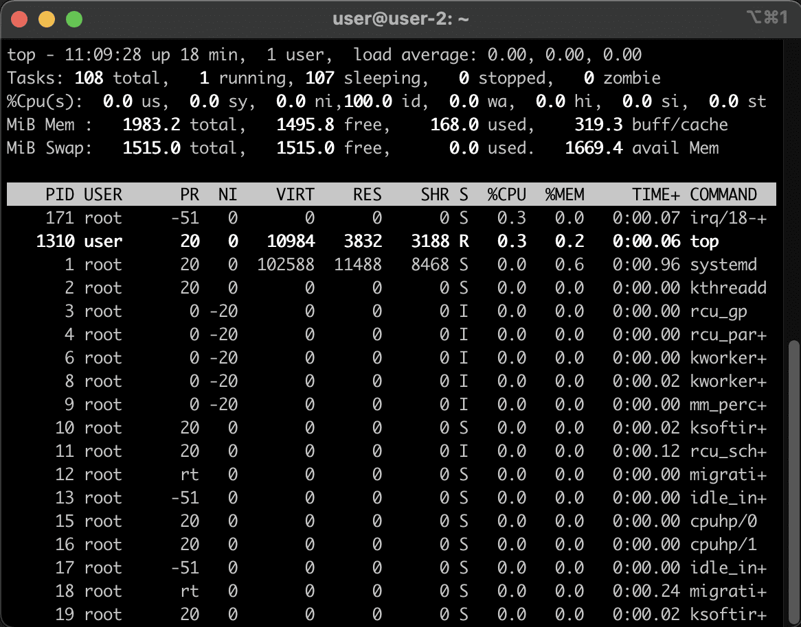
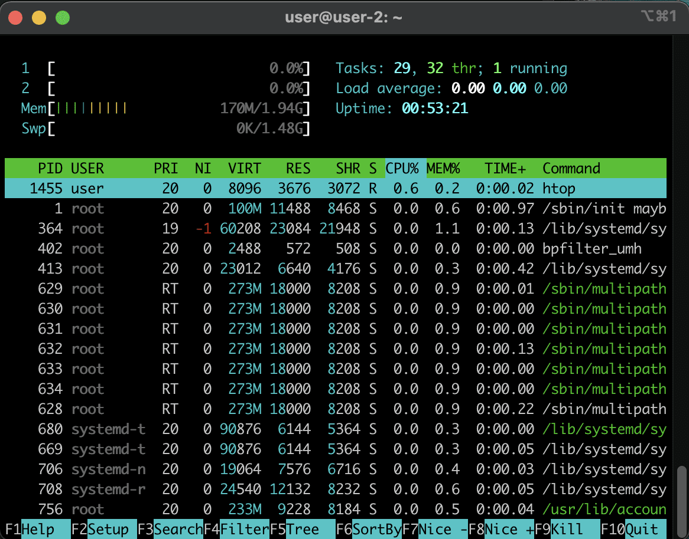
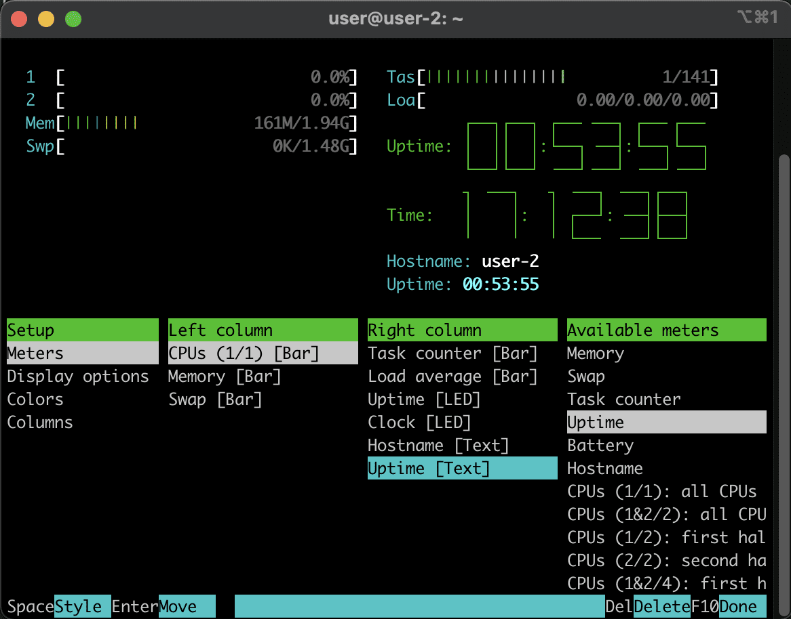

# Установка базового софта

## Part 7. Текстовые редакторы

> "Думаю мы готовы перейти к одному из самых страшных этапов." - гласит предисловие седьмой части

> "Я однажды зашёл в VIM - так до сих пор и не выхожу" - вторит предисловию известный среди олдов [анекдот](https://www.youtube.com/watch?v=Q1RUYQIgVKM "Выход из VIM")

Итак, начнём изучение текстовых редакторов. Алгоритм простой - создать файл с названием "test_X.txt", где Х - название редактора.

В каждый файл вставляем свой никнейм, сохраняем и выходим.

Вставляем в отчёт скрины из каждого редактора.

Поехали!

### Шаг 1. Ужасный и могучий VIM

VIM - это и полноценная терминальная IDE, и заменитель Microsoft Word в командной строке. Им пользуются не только программисты, но и даже писатели. Всё зависит от набора плагинов, которыми VIM можно обвешать.

Сам по себе VIM очень функциональный редактор, но вместе с плагинами, коих за 30 с лишним лет его существования написано уже сотни, этот редактор становится едва ли не удобнее графических IDE и офисных систем. Но есть одно но - хоткеи.

Пользоваться VIM удобно и прекрасно только после долгого обучения всем необходимым горячим клавишам (которые далеко не всегда совпадают с привычными). Потому порог вхожденяи в магию VIM очень высокий, но глубоко познав магию VIM вряд ли захочется пользоваться другими редакторами.

В системе VIM уже есть, потому его не нужно устанавливать. Создаём наш файл:

``vim test_VIM.txt``

Теперь при попытке записать свой логин мы с удивлением обнаружим, что файл не редактируется. Нет, это не очередной глюк убунты, это не баг, это фича.

Файлы в VIM открываются сначала для чтения, чтобы мы, тупые пользователи, случайно не поменяли что-то в каком-нибудь конфиге. Защита от дурака в общем.

Чтобы её снять, надо перевести VIM в режим редактирования нажатием ``i``. Именно латинской ``i``, обращаем внимание на раскладку клавиатуры!

> Тут мы вводим свой никнейм и делаем скрин.

Далее нам надо выйти из этого режима нажатием "Escape". Ничего не происходит, но на деле мы теперь снова не можем писать. И выйти пока тоже не можем. В общем, время паниковать.

Теперь нам нужно передать VIM-у команду на сохранение и выход. Для этого жмём ``:`` (не важно в какой раскладке) и после вводим две буквы: w - write, записать изменения, и q - quit - выйти наконец из этой страшной программы и забыть всё поскорей.

Таким образом внизу экрана должно появиться

``:wq``

и после нажатием Enter мы выйдем из неё. Если же мы зашли в файл только поглазеть и ничего записывать нам не нужно - тогда Escape - ``:q``.

Точно так же после двоеточия можно ввести любую системную команду, и результат выполнения отобразиться внутри редактора (круто же, выходить не надо).

### Шаг 2. Лёгкий и удобный NANO

Если vim - Microsoft Word в мире терминальных редакторов, то nano можно назвать чем-то средним между обычным notepad и notepad++.

Работать в нём не сложнее, чем в обычном блокноте, при этом поддерживается подсветка синтаксиса, строк, и многие другие функции.

Ввиду быстроты и удобства лично я использую его для работы в системе, как ты мог уже убедиться.

Итак, создаём файл:

``nano test_NANO.txt``

В нём прописываем свой ник и выходим комбинацией ``control+X``. Нам предложат сохранить наш файл. Нажимаем "y" (обязательно в русской раскладке) и "Enter"

Всё легко и просто. Для эффективной работы стоит так же подучить комбинации клавиш nano, которые относительно просты и легко запоминаются.

### Шаг 3. Функциональный JOE

Теперь разберём хоть один редактор, которого нет по дефолту в системах linux. Это будет joe.

``sudo apt install joe``

После установки создадим наш файл:

``joe test_JOE.txt``

Текст можно писать сразу. Не забываем скринить. Выход с сохранением по ``control+K X`` (держим control и последовательно нажимаем K и X, раскладка не важна).

Так же нужно пройтись по заданию, закрыть файлы без сохранения, освоить функции поиска и замены слов. Всё это прекрасно гуглится.

## Part 8. Установка и базовая настройка сервиса SSHD

Коварные новосибирцы хотели, чтобы все обучающиеся мучались непосредственно в окне виртуалки, куда нельзя копипастить, до этого момента. Но мы оказались хитрее. Мы выполнили восьмую часть сразу после установки системы и уже работаем через ssh.

Для окончания этой части нужно выполнить следующее:

- прочекать службу через ps и заскриншотить вывод

``ps aux | grep sshd``

- заскринить настройки sshd - config-а

``nano /etc/ssh/sshd_config``

- Написать в отчёт, что мы сделали

``sudo apt install ssh``

и сконфигурировали его как надо (см. гайд с установкой системы).

- Заскринить вывод команды ``netstat -tan``, где фигурирует наш 2022 порт.

Ну и "В отчёте объяснить значение ключей -tan, значение каждого столбца вывода, значение 0.0.0.0." - здесь гугл тебе поможет.

## Part 9. Установка и использование утилит top, htop

Top и htop - это аналоги виндового "диспетчера задач", только терминальные. Они установлены в системе по-умолчанию и не требуют установки. Top устанавливается практически во всех дистрибутивах изначально, а вот htop в случае отсутствия можно установить командой ``sudo apt install htop``.

Ну а запуск каждой утилиты происходит по названию.

### Шаг 1. Top

Вот мой вывод top:

У тебя он будет отличаться. Посмотрим, что нам нужно определить здесь по заданию.

- **uptime** - надпись вверху, в моём случае ``up 18 min``, время обновляется каждую минуту
- **количество авторизованных пользователей** - в моём случае ``1 user``, если залогиниться не только через терминал, но и в virtualbox пользователь добавиться. Так же мы можем открыть сколько угодно новых подключений с TTY в терминале, и каждое будет считаться отдельным пользователем. Такая вот странная арифметика.
- **общую загрузку системы** - строка ``load average:``, в случае отсутствия серьёзных процессов всё по нулям.
- **общее количество процессов** - ``Tasks: 107 total``, и сколько из них спят, выключены или стали зомби (зомби это завершённые, но не очищенные из памяти процессы). Да, зомби и демоны - то, с чем сталкивается любой пользователь линукса. Но они всё равно не страшнее vim-а.
- **загрузку cpu** - ``%Cpu(s):`` - при бездействии часто тоже висит около нуля.
- **загрузку памяти** - ``MiB Mem :`` - загрузка оперативной памяти, ``MiB Swap:`` - загрузка файла подкачки. 
- **pid процесса занимающего больше всего памяти** - произвести сортировку по памяти можно при помощи хоткея ``Shift+M``, в отчёт записать ID самого верхнего процесса (цифры слева в колонке PID).
- **pid процесса, занимающего больше всего процессорного времени** - это та самая базовая сортировка, которая была у нас изначально. Так что выйдем из top при помощи клавищи ``q`` и ещё раз запустим ``top``. Теперь самый верхний процесс - наш клиент.

### Шаг 2. Htop

Тут всё удобно и красиво, можно даже тыкать мышкой:

- **Сортировка по PID, PERCENT_CPU, PERCENT_MEM, TIME** - тут всё просто. Тыкаем мышкой в PID - сортируется по PID... И т.д. Каждый вывод скриним.
- **отфильтрованному для процесса sshd** - клацаем на ``F4 Filter`` и вводим  "sshd". Результат скриним. Выходим на "Escape".
- **с процессом syslog, найденным, используя поиск** - клацаем ``F3 Search`` и ищем "syslog".

Отдельно стоит рассмотреть опцию **"с добавленным выводом hostname, clock и uptime"**.

Здесь мы учимся кастомизировать вывод htop и задаём ему только те параметры, которые нам нужно мониторить.

Для этого заходим во вкладку ``F2 Setup`` и опускаемся вниз к опции "колонки" (Columns). Во вкладке "Active Columns" опускаемся на "command" и добавляем колонки для наших опций:

Далее нам надо добавить нужные колонки:

- hostname
- clock
- uptime

Пробелом можно менять внешний вид каждой колонки.

## Part 10. Использование утилиты fdisk

Тут всё просто. Запускаем ``sudo fdisk -l`` и смотрим в выводе:

- **название жесткого диска** - В моём случае ``/dev/sda``, в твоём вероятнее всего тоже
- **его размер и количество секторов** - в моём случае ``10 GiB`` и ``20971520 sectors``
- **размер swap** - вывод команды ``sudo swapon --show`` выдаст нам размер и размещение нашего файла подкачки. Запишем его в отчёт.

## Part 11. Использование утилиты df

Здесь сначала нужно использовать как df (выводит информацию в блоках по 512 байт), так и df -h (отображает в более привычных нам байтах).

Флаг -Т так же выводит тип файловой системы.

Так ``df /`` выдаст нам все необходимые для первого отчёта, а ``df -Th /`` - для второго.

## Part 12. Использование утилиты du

Здесь я советую гуглить, за что отвечает каждый из проверяемых в задании разделов. Да и вообще в целом гуглить про файловую систему linux. Это интересно.

Для первого отчёта нам понадобится команда ``du -bh``, например, ``du -bh /home``.

Для второго - ``du -bh /var/log/*``

Ну и как обычно, скрин, отчёт.

## Part 13. Установка и использование утилиты ncdu

